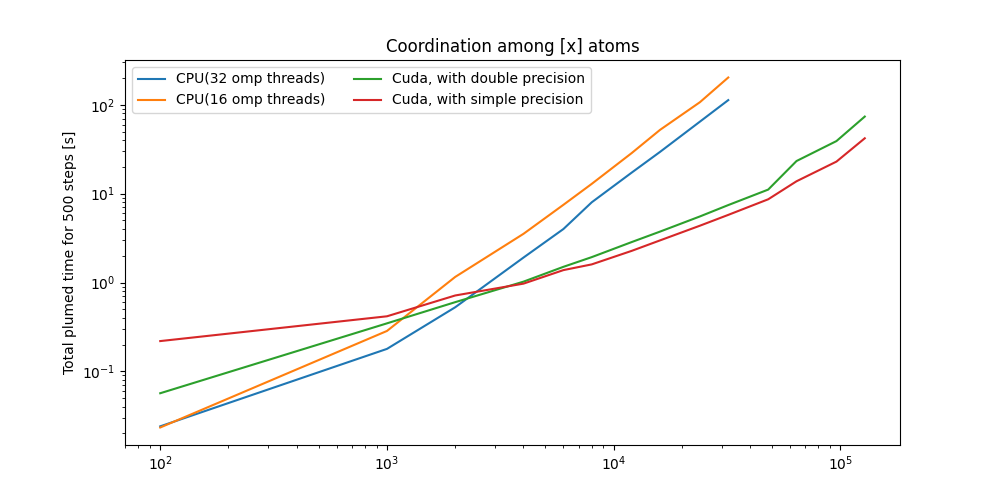
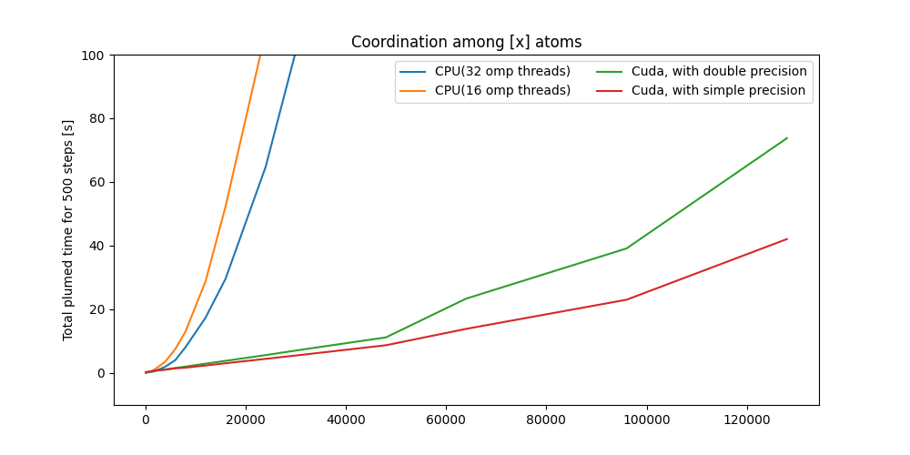

## Running plumed with cuda on LEONARDO

he executable files are shared in the $PUBLIC (`/leonardo/pub/userexternal/drapetti/plumed_cuda/`) directory of Daniele Rapetti on the LEONARDO supercomputer, the details are below.
This repository contains the data and the script to reproduce the images and the scripts to reproduce the benchmarks on LEONARDO.

### Preparing plumed

```bash
module load gcc/12.2.0
module load openmpi/4.1.6--gcc--12.2.0-cuda-12.2
module load cuda/12.2
git clone mt https://github.com/plumed/plumed2.git
cd plumed2
git checkout v2.10.0
CXX=mpic++ CC=mpicc ./configure #you can append a prefix here, to install
make -j11
# make install #optional
source ./sourceme.sh
cd plugins/cudaCoord
./nvcc-MakeFile.sh
make
cp CudaCoordination.so destinationDir/
```
Now CudaCoordination.so can be LOADED (see `cudacoord/plumedCuda.dat`) in a plumed.dat
The path is specified in `run/createCalculations.sh` as the `cudaSo` variable, and correspond to the file within the LEONARDO's $PUBLIC directory of Daniele Rapetti

### Running the benchmarks

The file referred in this section are in the `run` directory.
The benchmarks can be run with `./createCalculations.sh run` and will be stored in a subdirectory with the date and the time of the start of the simulation.
Omitting `run` will create a dummy check folder to verify that the input are correct.
You will need to modify the `submit.sh` file with the data necessary to run jobs on your LEONARDO account.

### Making the figures

The `figCuda.py` file creates the images should be modified accordigly to your data (just changing the paths to the `cudacoord`/`cudacoord_cpu` directories should be enough). Or used as is with the data embedded in the repository.
Remember to install the modules that are in the `requirements.txt` (the makefile will do that fot you).



